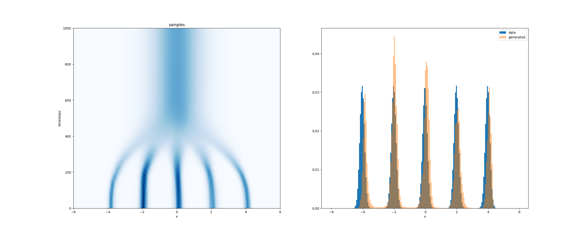
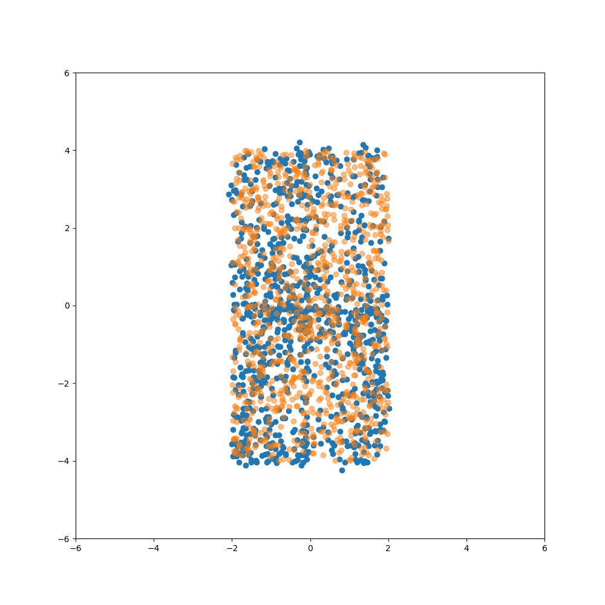
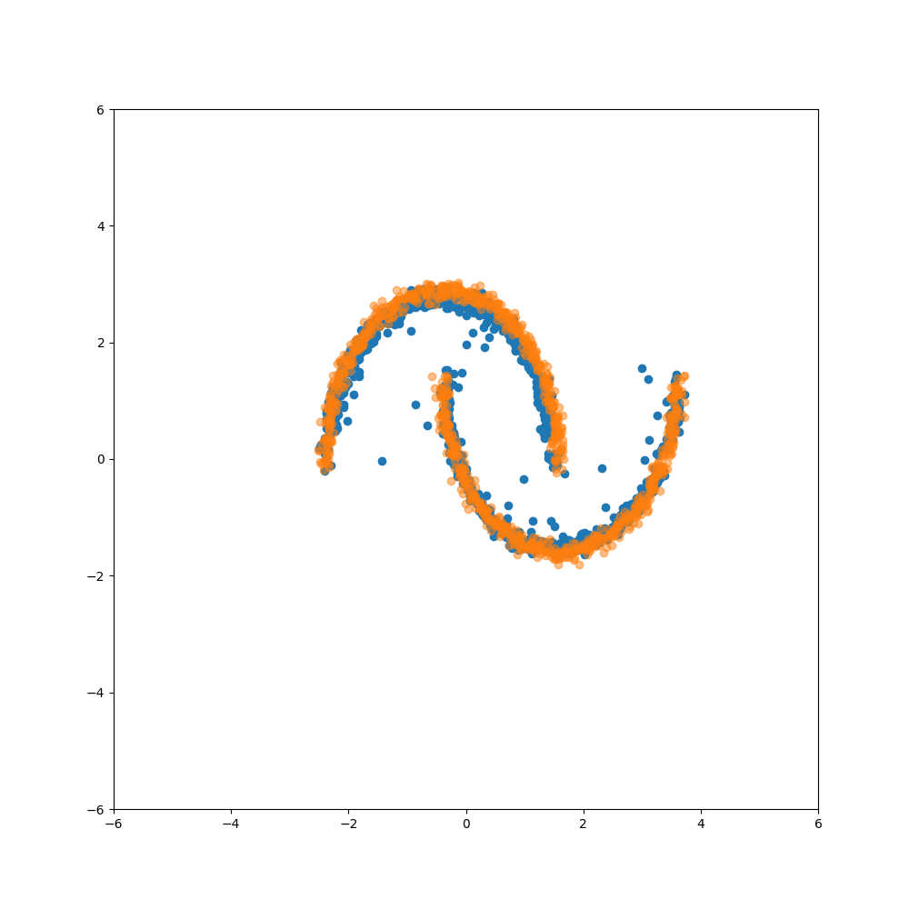
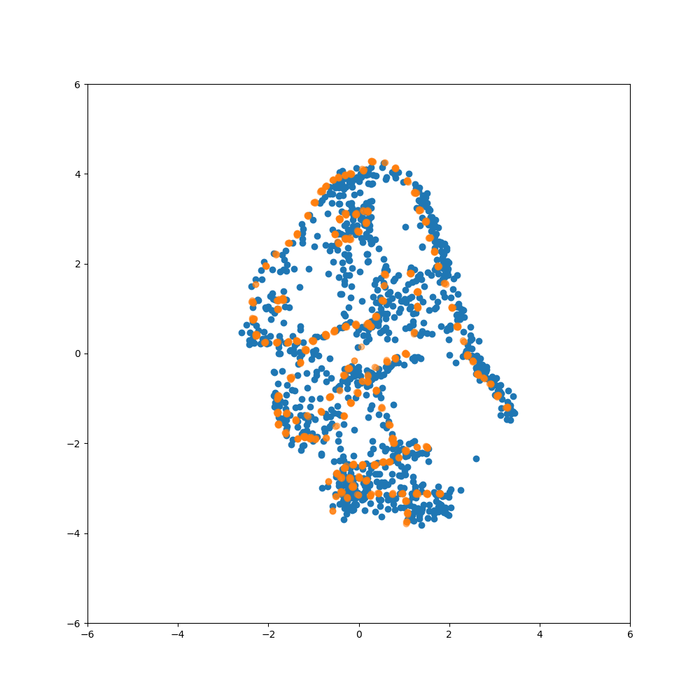
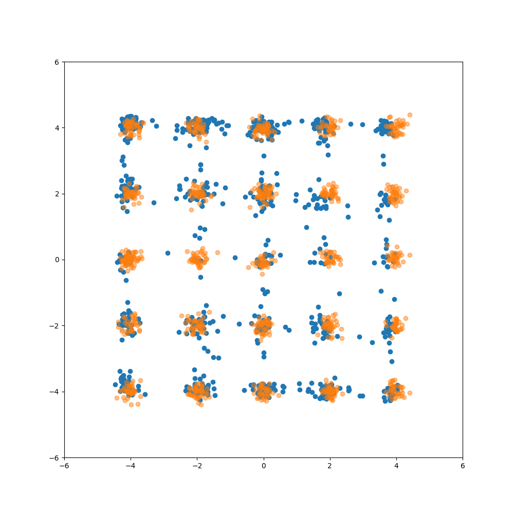
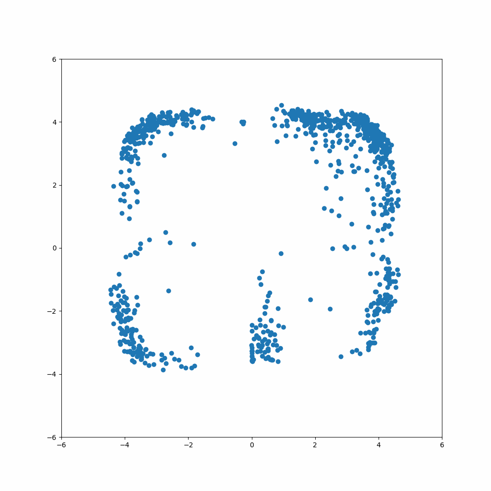
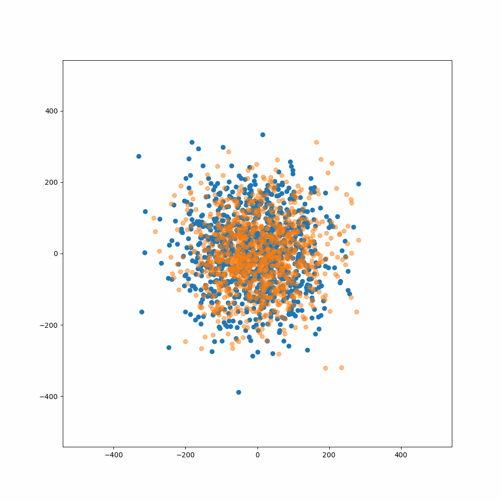

# tiny-edm

Minimal implementation of EDM diffusion models: **tiny-edm**.

This project is inspired by [tiny-diffusion](https://github.com/tanelp/tiny-diffusion) and [EDM](https://github.com/NVlabs/edm), and aims to provide a concise, pedagogical implementation of the EDM framework.

---

## 🚀 What is tiny-edm?

This repo implements the training and sampling procedures of Elucidated Diffusion Models (EDM) in a simplified form. It includes:

- EDM-style training with continuous timesteps.
- ODE and SDE-based sampling.
- 1D and 2D toy datasets (including classic ones like moons, gaussians, and the "dino" dataset).
- CUDA DataParallel + MPS support for Apple Silicon.

---

## 📦 Installation

```bash
git clone https://github.com/alexverine/tiny-edm.git
cd tiny-edm
pip install .
```

This will install the necessary packages defined in `setup.py`, including:

- numpy
- pandas
- matplotlib
- scikit-learn
- tqdm

---

## 🧑‍💻 Usage Examples

### Training on the 1D Gaussians dataset:
```bash
python train_edm.py --dataset 1Dgaussians --experiment_name 1DG --save_images_step 20 --num_epochs 500
```

### Sampling using all methods and timesteps (bash loop example):
```bash
samplers=("ode" "edm" "sde")
second_order=("" "--second_order")
timesteps=(1 2 5 10 20 50 100 500 1000)

for sampler in "${samplers[@]}"; do
    for order in "${second_order[@]}"; do
        for t in "${timesteps[@]}"; do
            python generate_edm.py \
                --path_model 1DG \
                --num_timesteps "$t" \
                --sampler "$sampler" \
                $order \
                --gen_batch_size 1024
        done
    done
```

### Other dataset examples
```bash
python train_edm.py --dataset dino --experiment_name Dino --save_images_step 10
python train_edm.py --dataset moons --experiment_name Moons --save_images_step 10
```

### To use a specific CUDA device (e.g., device 1):
```bash
CUDA_VISIBLE_DEVICES=1 python train_edm.py --device 0 --dataset gaussians
```

---

## ✨ Features

### Datasets
- 1D Gaussians: ```--dataset 1Dgaussians```

[](static/1Dgaussians.png)

-- Lines: ```--dataset lines```

[](static/lines.png)

-- Moons: ```--dataset moons```

[](static/moons.png)

-- Dino: ```--dataset dino```

[](static/dino.png)

-- 2D Gaussians: ```--dataset gaussians```

[](static/gaussians.png)


### Visualization of the training process
- Losses and samples are saved in the `exps/` directory.
- Losses are plotted in `exps/$expname/losses.png` and `exps/$expname/loss_eval.png`.
- Samples are saved in `exps/$expname/frames.npy` and can be visualized on `exps/$expname/training.gif`.
- Losses at different timesteps on the final training step are saved in `exps/$expname/loss_eval_t.png`.
- Generations samples are saved in `exps/$expname/final_frames.npy` and can be visualized on `exps/$expname/generation.gif`.

Example for the 2D Gaussians dataset:

[](static/gaussians_training.gif) [](static/gaussians_generation.gif)


---

## 🧪 Testing

Tests coming soon. Training scripts double as sanity checks.

---

## 🗂 File Structure

- `scripts/`: training and generation examples scripts.
- `exps/`: contains experiment logs, checkpoints, and visualizations.
- `tiny_edm/`: main package.
    - `datasets.py`: toy datasets.
    - `loss.py`: loss functions.
    - `model.py`: EDM model.
    - `positional_embedding.py`: positional embeddings.
    - `utils.py`: utility functions.
    - `vis_utils.py`: visualization functions.
- `train_edm.py`: training script.
- `generate_edm.py`: generation script.
- `setup.py`: installation script.
  

---

## 🤝 Contributing

Contributions are welcome! Feel free to open an issue or a pull request.

---

## 📚 Citation

If you use this repo for your research or teaching, please cite:

```bibtex
@misc{tinyedm2025,
  author = {Alexandre Verine},
  title = {tiny-edm: Minimal implementation of EDM diffusion models},
  year = {2025},
  howpublished = {\url{https://github.com/alexverine/tiny-edm}}
}
```

---

## 🔗 References

- The dino dataset comes from the [Datasaurus Dozen](https://www.autodesk.com/research/publications/same-stats-different-graphs)
- HuggingFace's [diffusers](https://github.com/huggingface/diffusers) library
- lucidrains' [DDPM in PyTorch](https://github.com/lucidrains/denoising-diffusion-pytorch)
- Jonathan Ho's [DDPM implementation](https://github.com/hojonathanho/diffusion)
- InFoCusp's [TensorFlow DDPM](https://github.com/InFoCusp/diffusion_models)
- NVIDIA's [EDM implementation](https://github.com/NVlabs/edm)
- [tiny-diffusion](https://github.com/tanelp/tiny-diffusion)

